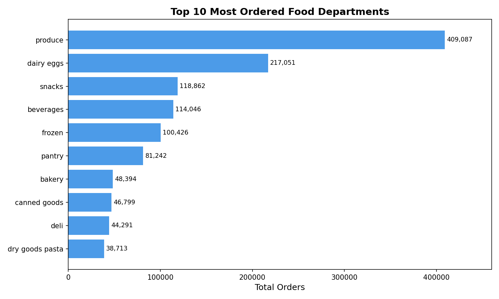
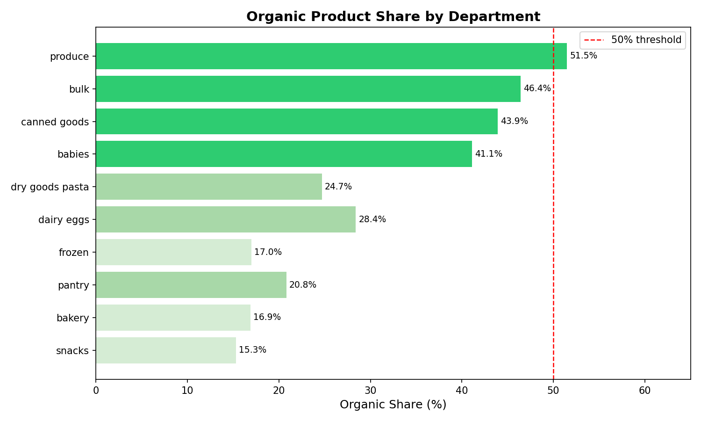
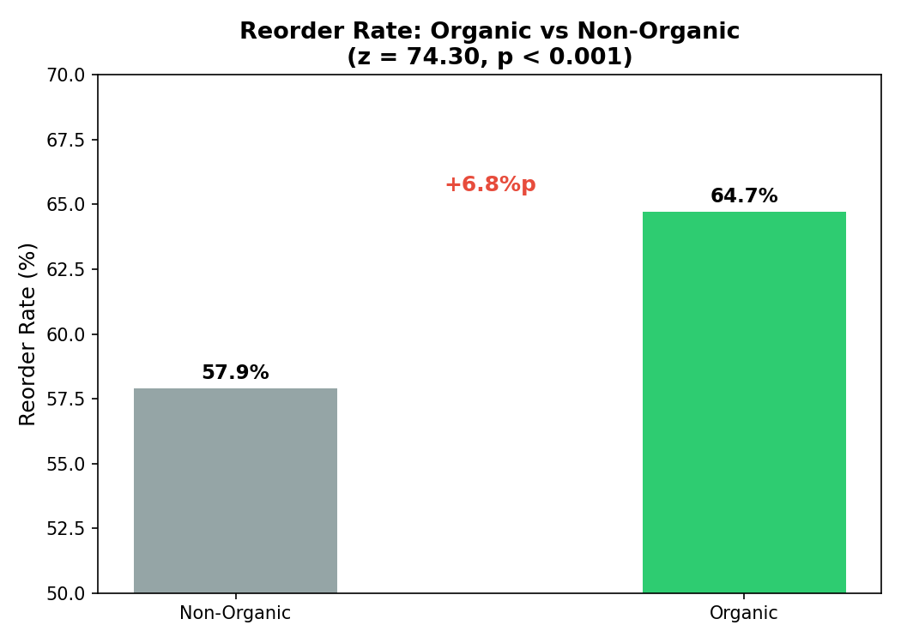

# 🛒 Instacart Consumer Purchasing Pattern Analysis

## Project Overview
This project analyzes 3.4M+ grocery orders from Instacart to uncover consumer purchasing behaviors and food industry insights using **MySQL** and **Python**.

As a Food & Nutrition Science graduate, I approached this analysis not only from a data perspective but also through a **food industry lens** — examining health-conscious purchasing trends, product loyalty, and consumer behavior patterns relevant to FMCG companies.

## Tools & Skills


- **MySQL** — data storage, querying, and analysis
- **Python (pandas, matplotlib, statsmodels)** — statistical validation and visualization
- **Python (SQLAlchemy)** — CSV to MySQL data pipeline

## Dataset
- **Source:** [Instacart Market Basket Analysis – Kaggle](https://www.kaggle.com/competitions/instacart-market-basket-analysis)
- **Scale:** 3.4M+ orders across 49K+ products and 206K+ customers

| Table | Rows |
|---|---|
| orders | 3,421,083 |
| order_products | 1,384,617 |
| products | 49,688 |
| departments | 21 |
| aisles | 134 |

## File Structure
```
instacart-consumer-analysis/
├── Market.sql               ← Q1–Q6B analysis queries with comments
├── market_analysis.py       ← statistical validation + visualization
├── chart1_top_departments.png
├── chart2_organic_share.png
└── chart3_reorder_rate.png
```

---

## Analysis & Key Findings

### Q1. Top 10 Most Ordered Food Departments



- **Produce ranked #1** with 409,087 orders — nearly 2x the second category (dairy eggs)
- Fresh and dairy categories dominate, reflecting essential grocery purchasing behavior
- Top 3 categories (produce, dairy eggs, snacks) account for over 50% of all orders

---

### Q2. Order Patterns by Day and Hour
- Orders peak between **10AM–2PM**, especially on **Sundays and Mondays**
- Late-night orders (12AM–5AM) are minimal across all days
- **Implication:** Promotional push notifications and flash deals are most effective on Sunday/Monday mornings

---

### Q3. Top 10 Products by Reorder Rate
- **Organic Low Fat Milk** leads with a **91.3% reorder rate**
- 9 out of 10 top products are milk variants → dairy staples drive repeat purchases
- **Banana** stands out as both high-volume (18,726 orders) and high-loyalty (88.4% reorder rate)
- **Implication:** These staple products are ideal anchors for subscription or bundle strategies

---

### Q4. Customer Segmentation by Purchase Frequency

| Segment | Customers | Share |
|---|---|---|
| Heavy User (10+ orders) | 110,728 | 53.7% |
| Regular User (5–9 orders) | 71,495 | 34.7% |
| Light User (1–4 orders) | 23,986 | 11.6% |

- Over half of customers are Heavy Users → strong platform retention
- **Implication:** Converting Regular Users (34.7%) to Heavy Users is the highest-ROI retention opportunity

---

### Q5. Average Purchase Cycle by Segment

| Segment | Avg Days Between Orders |
|---|---|
| Heavy User | 11.9 days |
| Regular User | 18.1 days |
| Light User | 20.0 days |

- Heavy Users shop roughly every **2 weeks**
- **Implication:** Reorder reminders targeted at Regular Users around day 15–17 could accelerate purchase cycles

---

### Q6. Organic Product Share by Department — *Food Industry Focus*



- **Produce is the only category where Organic surpasses Non-Organic (51.5%)**
- High organic share in babies (41.1%) and canned goods (43.9%) reflects the **clean-label trend** expanding beyond fresh food into processed categories
- Low organic share in snacks (15.3%) and beverages (11.2%) suggests strong brand loyalty limiting organic penetration

> *From a food science perspective, the 51.5% organic share in produce signals that health-conscious purchasing has shifted from niche to mainstream — a critical data point for FMCG portfolio strategy.*

---

### Q6-B. Reorder Rate: Organic vs Non-Organic — *Statistical Validation*



| | Organic | Non-Organic |
|---|---|---|
| Reorder Rate | **64.7%** | 57.9% |
| Total Orders | 405,617 | 979,000 |
| Unique Products | 4,251 | 34,872 |

**Statistical Test:** Two-proportion z-test
- Z-statistic: 74.30
- P-value: < 0.001
- **Result: Statistically significant**

> *Organic products show a 6.8 percentage point higher reorder rate, confirmed statistically significant (z = 74.30, p < 0.001). Combined with the 51.5% organic dominance in produce, this suggests organic purchasing has become habitual — supporting a premiumization strategy for FMCG brands targeting health-conscious consumers.*

---

## Business Implications Summary

| Finding | Implication |
|---|---|
| Produce & dairy dominate orders | Prioritize these in inventory and promotions |
| Peak hours: Sun/Mon 10AM–2PM | Schedule promotions around peak traffic |
| Milk & banana: highest reorder | Ideal for subscription/bundle anchoring |
| 53.7% Heavy Users | Focus on retention over acquisition |
| Organic > Non-Organic in produce | FMCG brands should expand organic portfolio |
| Organic reorder rate +6.8%p | Organic consumers show stronger loyalty → supports premium pricing |

---

*Rayun Sa · [LinkedIn](https://linkedin.com/in/rayun-sa) · sarayun932@gmail.com*
